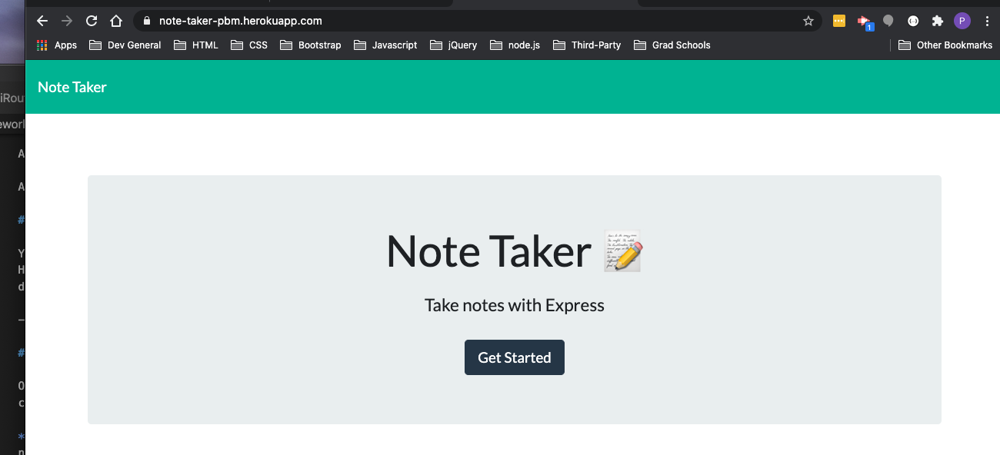
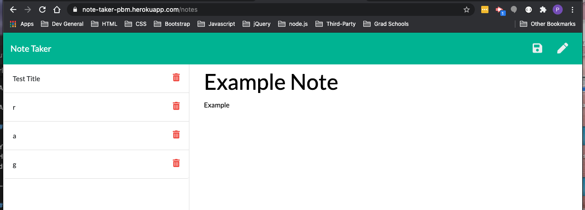

# Note Taker App
    
## Table of Contents

  - [Description](#description)
  - [Installation](#installation)
  - [Usage](#usage)
  - [License](#license)
  - [Contributing](#tests)
  - [Questions](#questions)
    
## Description
    
For users that need to keep track of a lot of information, it's easy to forget or be unable to recall something important. Being able to take persistent notes allows users to have written information available when needed. Therefore, this note taker app helps keep track of all those notes. 

    
## Installation
    
- Navigate to "https://note-taker-pbm.herokuapp.com/" 
- From the home page, click "Get started" to navigate to the notes page. 
- Add a title and text for your note, then click the Save button in the upper left-hand corner. 
- Click the "Delete" button (trashcan) to delete a note in the left pane.
    
## Usage
    
- Giving 100% on homework
- Adding notes
- Storing notes
- Deleting notes
    
## License

[mit](https://choosealicense.com/licenses/mit/)
    
## Contributing
    
If you would like to contribute it, please utilize The [Contributor Covenant](https://www.contributor-covenant.org/) as a guideline.
    
## Questions
    
### What's your GitHub info?
    
My GitHub username is pmo48 and my profile can be found at github.com/pmo48
    
### What other contact info do you have?
    
I can be contacted via email at pmoriarty100@gmail.com if you have any additional questions.
    